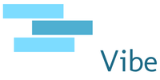

This is a Web Application written with Symfony 5 targeted at providing an easy way to log an E-Mail, and subsequently email an aggregated list daily with a positive quote; the intent being to generate an upbeat mood.

---
## Demo
A live demo can be found **[here](https://kaminski.pw/vibe)**

---
## Built With

- PHP (>=7.4.0)
- Symfony 5 (>=5.1)
- jQuery (>= 3.5.1)
- Twig (>= 3.0)

---
## Setup
- Clone to your preferred location
- Install the required dependencies (`composer install`) 
- Bind your database in `.env`
- Construct your database (`php bin/console make:migrate`)
- Execute the migration (`php bin/console doctrine:migration:migrate`)
- Populate the phrase table with positive messages!

---
## License
This project is licensed under the terms of the MIT license.
